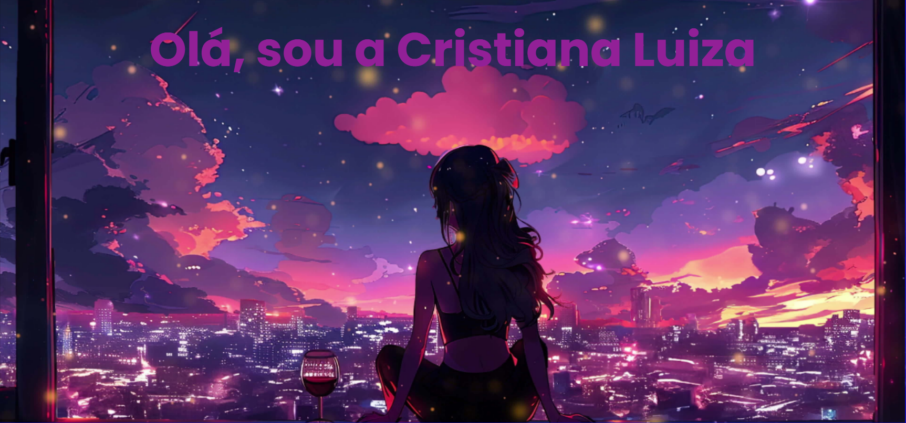

- 😊 Apaixonada por desenvolvimento
- 🌱 Me aprofundando em JAVA
- 📫 E-mail- cristiana.luiza@outlook.com
  
<h1>
 

  <a href="https://github.com/cristianaLuiza">
  
   
 
  

  
 
  
    
  
  
  
   

  

## 

 
  
  </a> 
  
 
  

